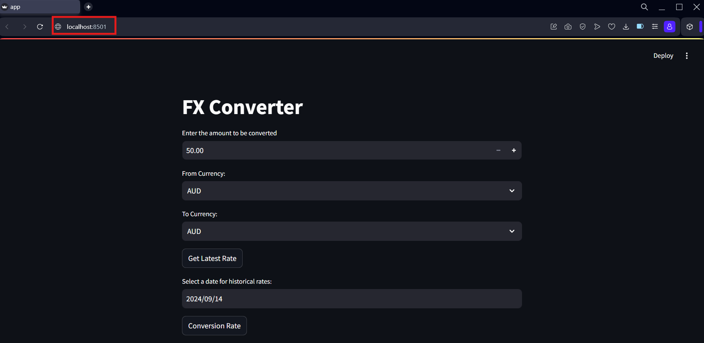

<p align="center">
  <a href="https://www.uts.edu.au/" target="blank"></a>
</p>

# 94962 - Data Science Practice - AT2 - Building Currency Converter in Python

## Author
**Name:** Juan Diego Balsero Leon

**Student ID:** 24896577

## Description
This application is designed to perform currency conversions between selected currency codes using data from the Frankfurter API. The app utilizes the latest exchange rates for conversions but can be configured to use specific rates from previous dates.

### Challenges
The development of the web application focuses not only on core functionalities but also on aspects such as design, availability, error management, and user experience. Some of these challenges were addressed using the Streamlit package, which offers support for user interface elements, error handling, layout positioning, and more. This allows the developer to concentrate on implementing core features and meeting the primary requirements of the web application. Integrating the Frankfurter API presented an additional learning opportunity in connecting and making HTTP requests between APIs and web applications. This required the developer to explore status code management, response handling and transformation, and error handling.

### Future expectations
The primary goal is to enhance the current web application to handle a large volume of simultaneous conversion requests while ensuring availability and performance. Another objective is to implement a more advanced API that supports additional currency codes and options, improving the application's usability. This process will also provide opportunities to deepen technical knowledge in areas such as web development, front-end and back-end integration, and continuous integration and deployment.

## How to Setup
<p>
  <a href="https://www.python.org" target="blank"></a>
</p>

### Installing Python
To install python, please download the corresponding installation file according to the OS environment:
https://www.python.org/downloads/.

Make sure that the installation version is **3.12.4**

#### Useful Installation tutorials
* **MacOS:** https://youtu.be/XX5KRfmfNvw
* **Linux:** https://youtu.be/5jrSYA_Ki00
* **Windows:** https://youtu.be/i-MuSAwgwCU

### Libraries and dependencies
The current web application contains the corresponding packages and versions:
* Streamlit: 1.38.0
* Requests: 2.32.3

All of these packages needs to be installed with the help of the pip tool for python, in order to get
full functionality of the web app as shown on the following command prompts:
```
pip install streamlit
```
```
pip install requests
```

## How to Run the Program
The first step is to open the command terminal (command prompt) and make sure that it is placed on the project folder.

In order to run the currency converter application, execute the following command:
```
streamlit run app.py
```
The web app will immediately start on the following direction: ```http://localhost:8501```



## Project Structure
The Currency Converter project contains the following folder schema:
```
├── dsp_at2__24896577
│   ├── images
│   │   ├── image.png
│   ├── api.py
│   ├── app.py
│   ├── currency.py
│   ├── frankfurter.py
│   ├── README.md
```
* ```dsp_at2__24896577:``` Current project folder.
* ```images:``` Source images folder for documentation.
* ```api.py:``` API get HTTP request file.
* ```app.py:``` Core logic of the application.
* ```currency.py:``` Functions of rates handling and output formatting.
* ```frankfurter.py:``` External API endpoint management.
* ```README.md:``` Documentation and Set-Up file.

## Citations
<p style="display: flex; align-items: center">
  <a href="https://docs.streamlit.io" target="blank"></a>
  <span style="margin-left: 10px;">
    Streamlit Documentation: <a href="https://docs.streamlit.io" target="blank">https://docs.streamlit.io</a>
  </span>
</p>

<p style="display: flex; align-items: center">
  <a href="https://www.frankfurter.app/docs/" target="blank"></a>
  <span style="margin-left: 15px;">
  For more information about the Frankfurter API please refer to: <a href="https://www.frankfurter.app/docs/" target="blank">https://www.frankfurter.app/docs/</a>
</p>